# Welcome to Spring Petclinic Serverless CI/CD Project!

This is a project for Python development with CDK to build Spring Petlinic Serverles CI/CD process and infrastructure. You will use four CI/CD processes to demo deploy Static web resource, Customer service, Vet service and Visit service separately. You must have meet [requirement](../README.md#prerequisites) before to start below.

## Deploy Static Resource CI/CD Infrastructure

First of all we must deploy Web Static and some common resources like API Gateway. We manually create a virtualenv on MacOS and Linux in this project root folder:

```bash
cd static-service-cicd && python3 -m venv .env
```

After the init process completes and the virtualenv is created, you can use the following
step to activate your virtualenv.

```bash
source .env/bin/activate
```

Once the virtualenv is activated, you can install the required dependencies.

```bash
pip install -r requirements.txt
```

At this point you can now synthesize the CloudFormation template for this code.

```bash
cdk synth
```

After review the CloudFormation template you deploy all the Infracture codes using:

```bash
cdk deploy
```

When the CDK deploy completed you should go to [CodeCommit console](https://console.aws.amazon.com/codesuite/codecommit/repositories) and if you select the right AWS Region then you can get the `spring-petclinic-static-resource` repository HTTPS url address like `https://git-codecommit.<REGION>.amazonaws.com/v1/repos/spring-petclinic-static-resource`


To complete your code submit to the repository, run these command bellow:

```bash
cd static-resource && git init
git remote add origin *REPO_URL*
git add .
git commit -m "init commit"
git push --set-upstream origin master
```

When you `push` your code to the CodeCommit Repository, the Git tool will ask Username and Password, pelase follow [this Guide](https://docs.aws.amazon.com/codecommit/latest/userguide/setting-up-gc.html) the get the yours.

After all the codes commit to the repository, you can login the [CodePipeline console](https://console.aws.amazon.com/codesuite/codepipeline/pipelines) to check the CI/CD process and the process will automatically start.

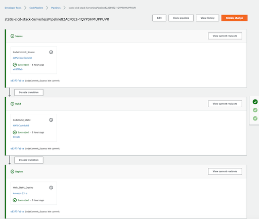

Finally, the CI/CD process will deploy the Petclinic static web resource to the Web bucket.

## Deploy Customer Service CI/CD Infrastructure

Deploy Customer, Vet and Visit microservices will more complicated than Static project. We will first deploy CI/CD infrastructure with CDK and then build microservice infrastructure and itself in our CodePipline. Pelase reference the detail information in [this guid](https://docs.aws.amazon.com/cdk/latest/guide/codepipeline_example.html).

Deploy the CI/CD Infra:

```bash
cd customer-service-cicd && python3 -m venv .env
source .env/bin/activate
pip install -r requirements.txt
cdk deploy customer-cicd-stack
```

When CDK deploy completed, you can find your CodeCommit repository HTTPS url for Customer service `spring-petclinic-customers-serverless` like `https://git-codecommit.<REGION>.amazonaws.com/v1/repos/spring-petclinic-customers-serverless`.

Submit the Customer service source code to this repository:

```bash
cd customer-service-cicd && git init
git remote add origin *REPO_URL*
git add .
git commit -m "init commit"
git push --set-upstream origin master
```

After all the source code `push` to the CodeCommit Repository, the CodePipeline will automatically start to build the serverless microservice infra and package and deploy them use another CloudFormation.

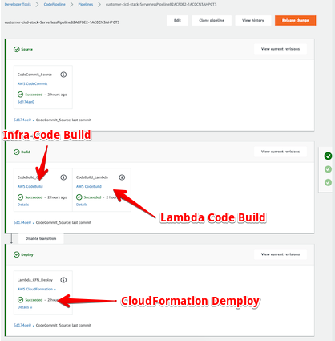

So when you have new version commit to the Repository this CI/CD process will automatically run and rebuild the Infra & Lambda Code and deploy the CloudFormation ChangeSet.

Next we will add this Lambda to our API Gateway endpoint. Go to [API Gateway console](https://console.aws.amazon.com/apigateway/home). Find the API your created in the [Static resource stack](static-service-cicd).

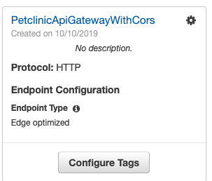

1. Create a new resource named `customer` under the `api` resource.

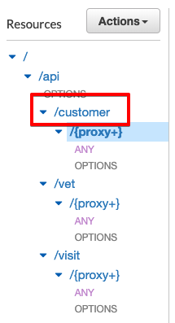

2. Create a `proxy` resource under `customer` and please `Enable API Gateway CORS` selected.

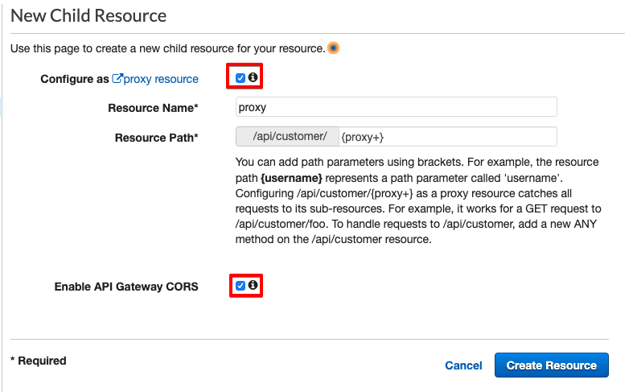

3. Connect to your Lambda function.


4. Add a CORS allow header for Web Broswer, click `customer/+{proxy}/option` and `Integration Response`, click the Pencil icon to modify the `Access-Control-Allow-Headers` Mapping value to `'cache-control,Content-Type,Authorization,X-Amz-Date,X-Api-Key,X-Amz-Security-Token'`

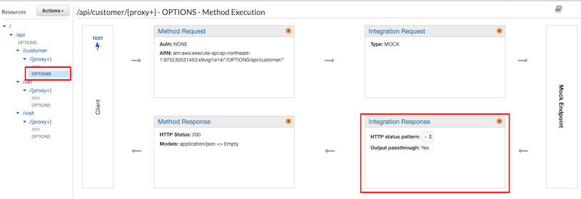

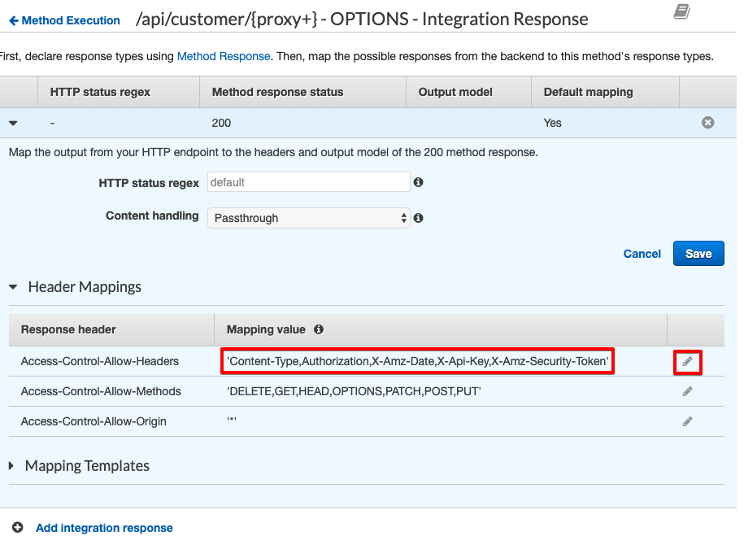

5. Deploy the API the PROD stage

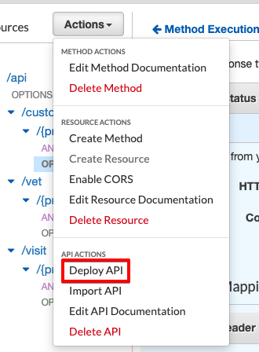

Finally, we will add our new Lambda function to Warmup CloudWatch Event we created in [Static resource stack](static-service-cicd):

1. Go to [CloudWatch console](https://console.aws.amazon.com/cloudwatch/home), and click Events>Rules menu.

2. Find the Static stack created Event:

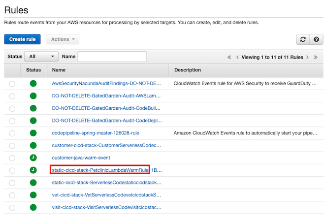

3. Click `Action>Edit` menu:

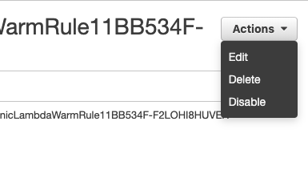

4. Select the Customer service Lambda function and click `Configure details` and `Update rule` to save your Event rule.

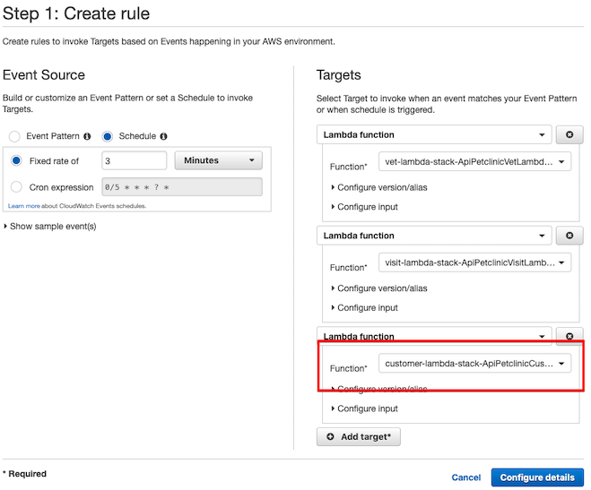

## Deploy Vet and Visit Services CI/CD Infrastructure

Use the same way to deploy Vet and Visit services just same as we have done and add the API Gateway endpoint resource for `vet` and `visit` to connect the Lambda functions we have created by CI/CD processes. Please don't forget to add both Vet and Visit Lambda function to Warmup CloudWatch Event Rule.

## Test your CI/CD Processes Deployment

Connect to the Static stack created Web Bucket URL

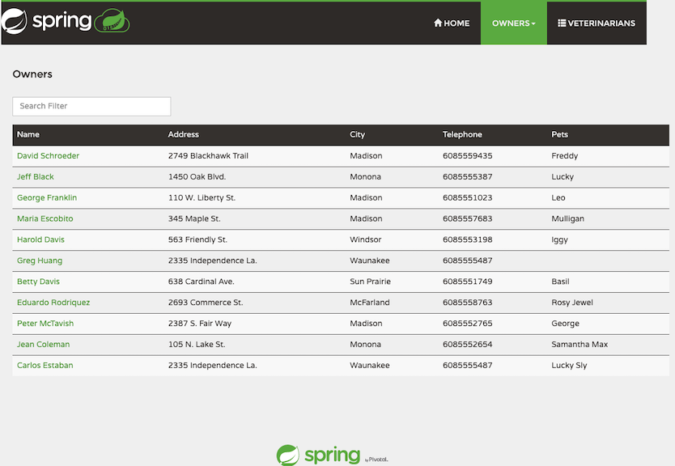

## Clean up all the AWS resources

```bash
cd static-service-cicd && cdk destroy
cd ../customer-service-cicd && cdk destroy customer-cicd-stack
cd ../vet-service-cicd && cdk destroy vet-cicd-stack
cd ../visit-service-cicd && cdk destroy visit-cicd-stack
```